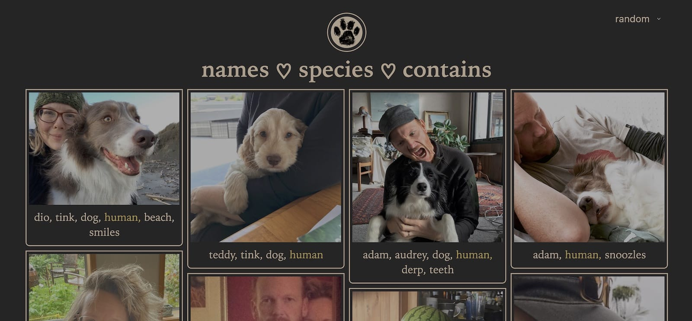

# The Fuzzler

Takes a folder full of cut animal photos and creates dynamic browsable, filterable, and sortable galleries.

## Requirements

- Node, Express, React, SQLite, Exifr
- Photos must have IPTC keyword tags matching `group/tag`:
  - `group` must be {name,species,with}
  - `tag` can be any single word

## Features

- Galleries can be filtered by group or tag
- Galleries are sorted randomly by default (desc views & asc/desc date optional)
- Remember sorting preference
- Lightbox for single image display
- Currently active navigation elements (logo, nav, tags) are highlighted
- Photo metadata (mostly IPTC keywords) imported to SQLite database
- Supports CSS3 native masonry galleries ([currently Firefox only](https://developer.mozilla.org/en-US/docs/Web/CSS/CSS_Grid_Layout/Masonry_Layout))

## Future Features

- [x] rename API endpoints to match best practice
- [x] use md5 for photo id and use for persistant photo links
- [ ] on group pages change thumbnails to link to persistant photo link
- [ ] search photos by filename, title, and tag
- [ ] use Redux for DB caching
- [ ] better lightbox for full size photo view
- [ ] uploading new photos (use md5 id for duplicate detection)
- [ ] add/edit/delete tags
- [ ] automatically optimise photos (resize thumbnails)
- [ ] serve images cropped to arbitrary dimensions ([example](https://random.imagecdn.app/v1/docs))
- [ ] create Docker image and deploy to server
- [ ] add tests

## Installation

- Put tagged photos into `server/public/images`
- Run `npm install`
- Run `npm run knex migrate:latest`
- Run `node server/db/updatedb.js`
